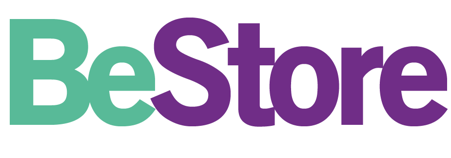
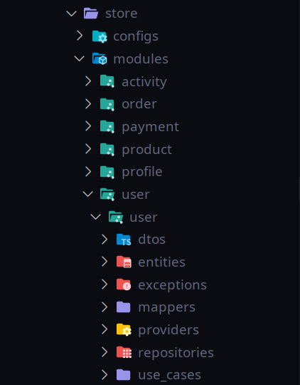
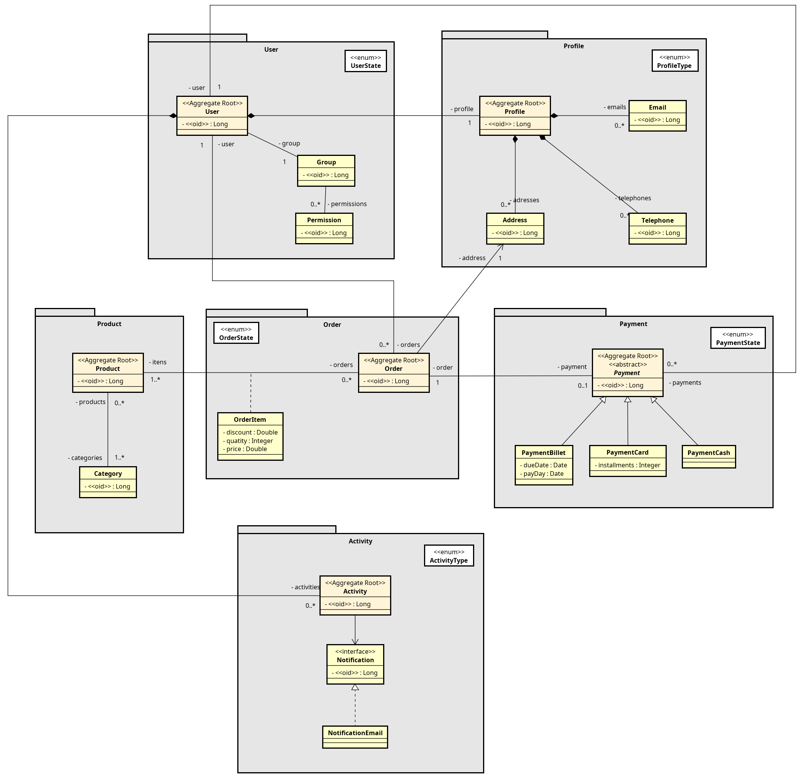

# BeStore

[](https://github.com/venzel/bestore/blob/master/LICENSE)

> **BeStore** é uma aplicação para venda de produtos em geral.<br /> <a href="http://bestore.me">👉 bestore.me</a>

<p align="center"></p>

## Projeto (Kanban)

👉 <a href="https://github.com/venzel/bestore/projects/1">Link para o Quadro Kanban<a>

## Tecnologias

API Rest em **Java** e **Spring Boot** com uma arquitetura **Feature by Package** (módulos e casos de usos).

<p align="left">
   
   
</p>

### Back end

-   Java
-   Spring Boot
-   JPA / Hibernate

### Persistência de dados

-   MySQL

### Outras informações

O projeto tem como gerencimento de pacotes o **Maven** e o **Makefile** como automação de comandos, além disso, o mysql é gerenciado através de um container do **Docker**.

#### Bibliotecas externas utilizadas

-   <a href="http://modelmapper.org">Model Mapper</a>
-   <a href="https://projectlombok.org">Lombok</a>

## Arquitetura

### Porque Feature by Package?

Feature by Package (FBP) é uma arquitetura que utiliza conceitos do **DDD (Domain Driven Design)**, sugerida por empresas como a **Rocketseat**, com o objetivo de tornar o código mais **flexível**, **escalável** e de **manutenção simples**.

### Vantagens da arquitetura

-   **MANUTENÇÃO**: Facilita o engajamento de muitas equipe e colaboradores em um projeto;
-   **ESCALÁVEL**: Facilita refatoramento do código monolítico para uma uma estrura de microserviços;
-   **SOLID**: Facilita a aplicação de todos os princípios do SOLID;
-   **GIT**: Melhora o gerenciamento dos commits, evitando conflitos e etc;
-   **TESTES**: Facilita o desenvolvimento de testes de unidade e integração.

### Organização das pastas

<p align="center"></p>

## Diagrama

### Versão 5



### Influências

Este projeto tem como principais influências, os fundamentos da <a href="https://rocketseat.com.br">Rocketseat</a>, <a href="https://devsuperior.com.br">DevSuperior<a> e <a href="https://www.algaworks.com">AlgaWorks<a>.

## Como executar o projeto

### Pré-requisitos

-   Java 11
-   Docker
-   Docker compose

```bash
# Para clonar repositório
git clone https://github.com/venzel/bestore

# Para entrar na pasta do projeto
cd bestore

# Para subir o container do mysql na porta 3306
make up

# Para executar o projeto na porta 8080
make run
```

## Autor

Edivam Enéas de Almeida Júnior

👉 <a href="https://www.linkedin.com/in/venzel">Linkedin</a>
