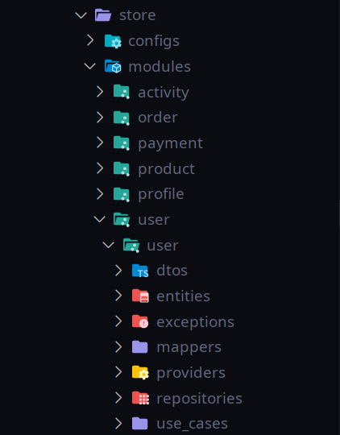

# Store

[](https://github.com/venzel/store/blob/master/LICENSE)

> **Store** é uma aplicação back end para venda de produtos.

## Tecnologias utilizadas

**Java** e **Spring Boot** com uma arquitetura **Feature by Package** (módulos e casos de usos), foram as tecnologias adotadas na aplicação.

### Back end

-   Java
-   Spring Boot
-   JPA / Hibernate
-   MySQL
-   Maven
-   Makefile

## Arquitetura

### Porque Feature by Package?

Feature by Package (FBP) é uma arquitetura que utiliza conceitos do DDD (Domain Driven Design), sugerida por empresas como a **Rocketseat**, onde, a estrutura apesar de ser um monolítico, é possível desenvolver um código mais **flexível**, **escalável** e de **manutenção simples**.

### Vantagens da arquitetura

-   **MANUTENÇÃO**: Facilita o engajamento de muitas equipe e colaboradores em um projeto;
-   **ESCALÁVEL**: Facilita refatoramento do código monolítico para uma uma estrura de microserviços;
-   **SOLID**: Facilita a aplicação de todos os princípios do SOLID;
-   **GIT**: Melhora o gerenciamento dos commits, evitando conflitos e etc;
-   **TESTES**: Facilita o desenvolvimento de testes de unidade e integração.

### Organização das pastas

<p align="center"></p>

## Diagrama

### Versão 3


### Influências

Este projeto tem como principais influências, os fundamentos da <a href="https://rocketseat.com.br">Rocketseat</a>, <a href="https://devsuperior.com.br">DevSuperior<a> e <a href="https://www.algaworks.com">AlgaWorks<a>.

## Como executar o projeto

### Pré-requisitos

-   Java 11
-   Docker
-   Docker compose

```bash
# Para clonar repositório
git clone https://github.com/venzel/store

# Para entrar na pasta do projeto
cd store

# Para subir o container do mysql na porta 3306
make up

# Para executar o projeto
make run
```

## Autor

Enéas Almeida

<a href="https://www.linkedin.com/in/venzel">https://www.linkedin.com/in/venzel</a>
