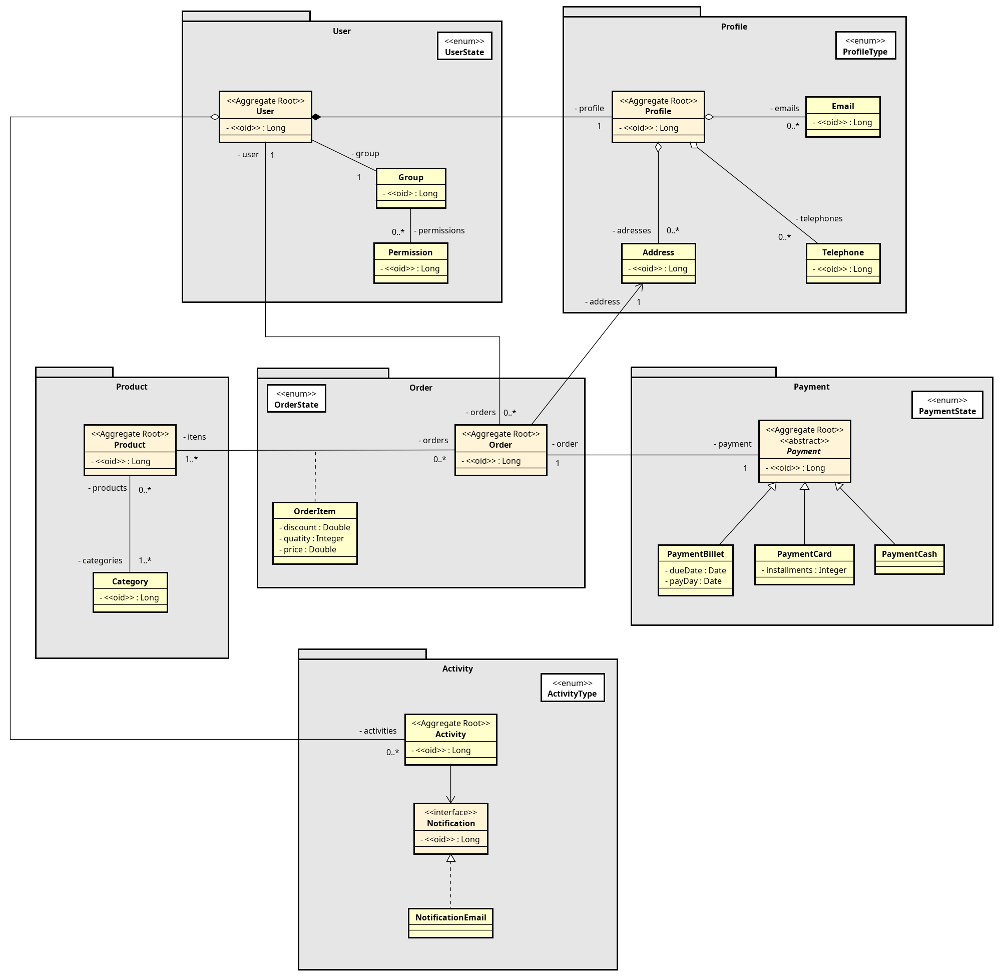

# Store

[](https://github.com/venzel/store/blob/master/LICENSE)

> <b>Store</b> é uma aplicação back end para venda de produtos.

## Tecnologias utilizadas

Java e Spring Boot com uma arquitetura Feature by Package (módulos e casos de usos), foram as tecnologias adotadas na aplicação.

### Back end

-   Java
-   Spring Boot
-   JPA / Hibernate
-   MySQL
-   Maven
-   Makefile

## Arquitetura

<center></center>

## Diagrama

### Version 3



## Como executar o projeto

### Pré-requisitos

-   Java 11
-   Docker
-   Docker compose

```bash
# clonar repositório
git clone https://github.com/venzel/store

# Para entrar na pasta do projeto
cd store

# Para subir o container do mysql na porta 3306
make up

# Para executar o projeto
make run
```

# Autor

Enéas Almeida

https://www.linkedin.com/in/venzel
