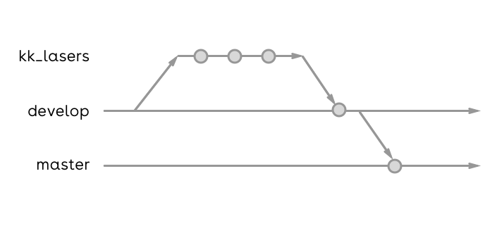

# Gitflow

> O Gitflow Worflow é um fluxo de trabalho do Git que auxilia o desenvolvimento contínuo de software entre a equipe envolvida.<br /><br />👉 <a href="https://www.atlassian.com/br/git/tutorials/comparing-workflows/gitflow-workflow">Mais informações</a>

\* Se faz necessários os conhecimentos básicos sobre git.

## Como funciona nosso fluxo

Cada projeto e suas equipes podem optar por um determinado fluxo, abaixo é demonstrado o método que adotamos e as responsabilidade para cada membro da equipe.



## Branchs

-   **kk_lasers** - Eviará commits e pull requests apenas para branch develop. (Atividade de usuário)
-   **develop** - Receberá os pulls requests de kk_lasers. e enviará pull requests para master (Atividade do owner do GIT).
-   **master** - Receberá o pull request final de uma release. (Atividade do owner do GIT).

### Diretrizes

\* A branch **master** é bloqueada pra receber commits e pull requests de kk_lasers. (recurso apenas no plano git pro), caso não possua o git pro, fica estabelecido, a proibição o envio de commits e pull requests do kk_lasers para master.

\* A branch **master** representa o software em **produção**.

\* Fica determinado que a branch develop nunca será deletada.

\* Fica determinado que sempre que um pull request na branch develop for aprovado ou reprovado, a branch do usuário será deletada, a fim de manter o git organizado.

### Etapas básicas no processo de interação no git

1 - Clona o repositório

```bash
$ git clone https://github.com/venzel/bestore.git
```

2 - Criar uma branch com seu nome a partir da branch develop

```bash
# Tiago é um nome fictício, modifique para seu nome
$ git checkout -b tiago origin/develop
```

3 - Todos os dias antes de iniciar as atividades de desenvolvimento e alteração de código, sempre fazer um pull da branch develop, para sincronizar tudo o que foi enviado para branch develop.

```bash
# Importante, estando na branch tiago
$ git pull origin develop
```

4 - Para enviar um commit para sua branch

```bash
# Tiago é um nome fictício, modifique para seu nome
$ git push origin tiago
```

5 - Após a conclusão de um bloco de desenvolvimento, solicitar um pull request para branch develop

### Autor

Edivam Enéas de Almeida Júnior
